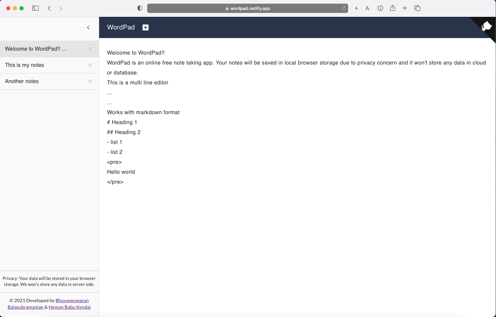

<h1 align='center'>Wordpad</h1>

<p align="center">
 
<a href="https://app.netlify.com/sites/wordpad/deploys"></a>
</p>

<div align="center">
    
</div>

## About

A simple online note taking app. Notes will be stored in user's browser and it won't store any data in cloud or database.

**[Demo](https://wordpad.netlify.app)**

## Tech Stack

- React
- Typescript
- Material UI
- HTML
- CSS

## Development

Clone and install

```shell
git clone https://github.com/bhuvanbalasubramanian/wordpad.git

cd wordpad

npm install
```

Run a development server.

```shell
npm run start
```

Runs the app in the development mode.\
Open [http://localhost:3000](http://localhost:3000) to view it in the browser.

Build the project.

```shell
npm run build
```

## License

This project is open source and available under the [MIT License](LICENSE).
